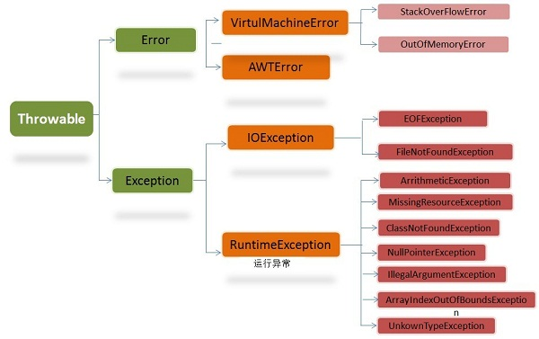

## Java深入知识

这里面包含更深一点的Java知识，涉异常处理、序列化等。

1. **Java异常处理的结构？**
   
在 Java 中，所有的异常都有一个共同的祖先java.lang包中的 Throwable类。Throwable有两个重要的子类：
* **Exception**（异常）：指程序可以处理的异常情况，通常是由于开发人员的逻辑问题引起，通过try-catch块可以进行处理。常见的有：NullPointerException（空指针异常，访问的对象方法或属性时，对象没有指向任何实例）、ArrayIndexOutOfBoundsException（数组越界异常，数组下标超出了数组所在内存范围）
* **Error**（错误）：指程序不能处理的异常情况，错误一般与开发人员无关，往往是虚拟机也无法预料的异常，它没办法通过try-catch去处理。如OutOfMemoryError（内存溢出异常，指虚拟机无法再获取到程序所需的内存）、NoClassDefFoundError（无字节码文件异常，指虚拟机根据调用者的描述路径找不到响应的字节码）。这些异常发生时，Java虚拟机（JVM）一般会选择终止线程。

>异常的类图如图：


2. **Throwable类常用方法？**
 * `public string getMessage()`：返回异常发生时的详细信息，比较详细，一般记录进error级别的日志中
 * `public string toString()`：返回异常的简要信息
 * `public string getLocalizedMessage()`：返回异常对象的本地化信息。使用Throwable的子类覆盖这个方法，可以声称本地化信息。如果子类没有覆盖该方法，则该方法返回的信息与getMessage()返回的结果相同
 * `public void printStackTrace()`：在控制台上打印Throwable对象封装的异常信息

3. **异常处理的方式？**
   
一般使用try-catch-finally代码块来捕获和处理异常：
* `try`：try块内包含需要进行异常捕获的代码，它必须与catch或finally并存
* `catch`：用于对捕获的异常进行业务处理，通常是记录日志并返回友好的错误信息
* `finally`：无论什么情况，finally块中的代码总会被执行。除非代码块中出现异常，或者线程被终止、CPU关闭。

*P.S：以下代码块，入参为2时返回值是什么？*
```java
public static int func(int value) {
    try {
        return value;
    } finally {
        if (value == 2) {
            return 0;
        }
    }
}
```
答案是0，因为真正返回之前会执行finally内的逻辑，并且覆盖原值。

4. 序列化和反序列化是什么？如何操作？

* **序列化**：将对象转换为字节序列的过程。

 Java提供了java.io.ObjectOutputStream类来完成对对象的序列化操作，如下：


* **反序列化**：将字节序列转化为对象的过程。

5. 什么是反射？如何进行反射？

6. 如何通过反射获取到类的属性信息？