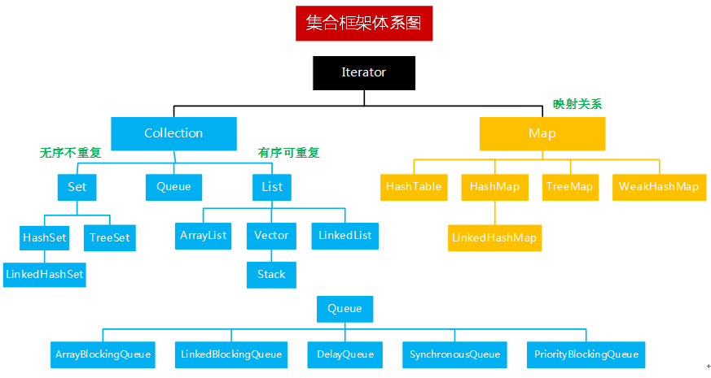

## 集合常见问题

### **1. Java中集合类有哪些？**
开局一张图：
>
来自[菜鸟教程](https://www.runoob.com/java/java-collections.html)

图看的眼花缭乱不要紧，我们直接找出关键。集合的顶级接口是`Collection`和`Map`，简单来看Java的集合归属关系如下：
- `Collection`
  - `List`：`List`的主要实现类是`AbstractList`，`Vector`、`ArrayList`、`LinkedList`直接或间接继承了`AbstractList`
  - `Set`：`Set`的主要实现类是`AbstractSet`，`HashSet`、`TreeSet`直接继承了`AbstractSet`
- `Map`
  - `Map`的主要实现类是`AbstractMap`，`HashMap`、`TreeMap`、`HashTable`继承了`AbstractMap`

另外还可以再记一下：
- `AbstractList`和`AbstractSet`实现了`AbstractCollection`，而`AbstractMap`却没有（*我简单理解为它们数据结构不同，后议*）
- `TreeSet`和`TreeMap`分别实现了`SortedSet`和`SortedMap`，因为它们实现了排序

我们换种方式来看：  

在面试中，能把上面的东西说出来我觉得已经能覆盖到常用的集合里了，接下来我们进行一些归类对比。

### **2. List、Set、Map有什么区别？**
这个问题可以换很多种问法，比如*List（Set、Map）有什么特点？*、*我想有序存储怎么办？*，答案都是一样的，记住他们每个的特点，以不变应万变。

- List：可以**顺序**地存储一组对象，值的存储顺序与放入顺序一致
- Set：存储的数据**不重复**，但是不保证顺序
- Map：**键值对**存储，key不允许重复，两个不同的key可以指向同一个value

### **3. Arraylist与LinkedList区别?**
既然是List的两个实现的比较，建议从不同方面，由浅入深地来说：  
1. 从数据结构来看，`Arraylist`采用**数组**存储数据，而`LinkedList`采用**双向链表**存储
2. 基于数组的特性，`Arraylist`在元素数量达到一定程度时需要进行扩容操作，占用连续的内存空间；而`LinkedList`无需扩容，内存可以不连续
3. `Arraylist`在插入或删除元素的时间复杂度受到元素位置的影响而不稳定，但是查找效率很高（O(1)）；`LinkedList`在插入或删除元素时只需变换指针，所以效率很高，但是查找元素时需要遍历链表，所以效率低下

因此简单来讲，如果读多写少，用`Arraylist`；读少写多，用`LinkedList`更好。

### **4. HashMap、HashTable有什么区别？**
1. `HashMap`不是线程安全的，`HashTable`线程安全
2. 因为线程安全的原因，`HashTable`的效率当然会更低一些
3. `HashMap`支持一个`null`作为key，但是`HashTable`不允许，会跑出`NullPointerException`
4. 容量：  
    - `HashMap`默认大小16，每次扩容为原来的2倍，`HashTable`默认11，每次扩容为原来的2n+1
    - 若指定大小，`HashMap`会将其扩充为2的幂次方大小（`tableSizeFor()`方法），`HashTable`直接使用指定大小

最后记得说一句：*`HashTable`为了保证线程安全，内部所有操作都加锁，因此效率低下现在已经过时，使用ConcurrentHashMap也能保证线程安全且效率更高*，把话题引入ConcurrentHashMap，这块在Map小节单独说。

### **5. HashMap、HashSet有什么区别？**
抛出这个问题，我想面试官可能就想考察下你对Set这块有没有什么了解，因为对于我实际工作来说，Set用的还是偏少，我想如果能回答出以下几点就应该可以过了：  
1. `HashSet`的实现比较简单，直接继承了`HashMap`，大部分操作其实都是通过`HashMap`来完成的
2. `HashMap`是键值对存储，`HashSet`只能存储元素，且不能重复，与`HashMap`的key特性一致
3. `HashMap`通过`put()`方法添加元素，`HashSet`使用`add()`方法
4. 它们都是通过计算hash来确定元素位置的