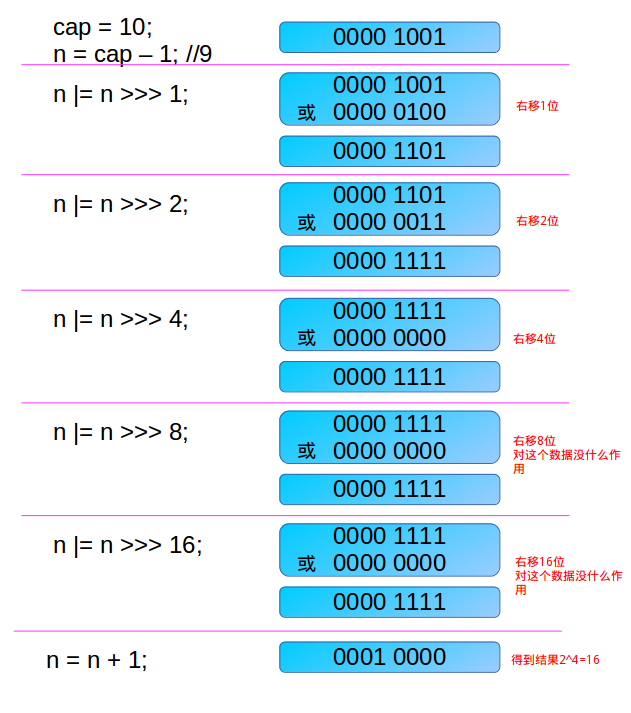

## HashMap相关问题

### HashMap有了解吗？简单讲一下
`HashMap`顶层是`Map`接口，以`key-value`键值对的方式存储数据。  
`HashMap`底层基于**数组+链表**形式存在，所以：  
- `HashMap`在内存分布上是一个连续的空间，并且如果空间达到设定的阈值（默认负载因子为0.75）需要进行扩容，每次扩容容量都到2的n次方；
- 它通过`key`的hash来确定`value`在数组中的位置，在出现hash冲突时，比较key的值（`equals()`方法）是否相等，如果相等则覆盖原值，如果不相等采用**拉链法**解决冲突
- 在JDK1.8开始对解决冲突做了优化，当链表长度超过8时，将链表转化为红黑树。

#### 构造方法源码：
HashMap有四个构造方法：
```java
// 一、默认的无参构造方法，初始化了负载因子为默认的0.75
public HashMap() {
    this.loadFactor = DEFAULT_LOAD_FACTOR; // all other fields defaulted
}
// 二、指定数组初始大小的构造方法，实际调用下面的构造方法
public HashMap(int initialCapacity) {
    this(initialCapacity, DEFAULT_LOAD_FACTOR);
}
// 三、使用另一个Map的实例构造HashMap实例，比如将TreeMap快速转化为HashMap
public HashMap(Map<? extends K, ? extends V> m) {
    this.loadFactor = DEFAULT_LOAD_FACTOR;
    putMapEntries(m, false);
}
// 四、同时指定初始容量和负载因子的构造方法
public HashMap(int initialCapacity, float loadFactor) {
    if (initialCapacity < 0)
        // 初始容量小于0，抛出异常
        throw new IllegalArgumentException("Illegal initial capacity: " + initialCapacity);
    if (initialCapacity > MAXIMUM_CAPACITY)
        // 初始容量大于最大值（1 << 30相当于2^30），设置为最大值
        initialCapacity = MAXIMUM_CAPACITY;
    if (loadFactor <= 0 || Float.isNaN(loadFactor))
        // 负载因子小于等于0或者非浮点数，抛异常
        throw new IllegalArgumentException("Illegal load factor: " + loadFactor);
    // 设置负载因子
    this.loadFactor = loadFactor;
    // 设置初始大小，需要经过tableSizeFor()方法处理为2^n
    this.threshold = tableSizeFor(initialCapacity);
}
```
#### tableSizeFor源码：
这个方法保证了HashMap总是使用2的幂作为哈希表的大小。
```java
static final int tableSizeFor(int cap) {
    // 将期望设置的容量先-1，是为了让计算后的值大于或等于原值
    int n = cap - 1;
    // 将n无符号右移1位（相当于n/2^1），再按位或n，结果给n。
    n |= n >>> 1;
    n |= n >>> 2;
    n |= n >>> 4;
    n |= n >>> 8;
    // 最后一次右移16位结束，我的理解是：
    // 这个方法目的是为了使容量大小保持在2的n次方，所以移位或操作的目的是为了得到一个全1的二进制，然后再+1就可以得到2的n次方
    // 因此，右移16位相当于n/2^16，而int型占用32位，所以右移16位就一定可以达成目的。
    n |= n >>> 16;
    // 计算之后，n小于0就返回1，大于等于0时需要判断是否到达最大值，够的话直接使用最大值，不够的话就+1。这样返回的容量范围就是[1, 2^30]
    return (n < 0) ? 1 : (n >= MAXIMUM_CAPACITY) ?  MAXIMUM_CAPACITY : n + 1;
}
```
没看懂移位那块的注释没关系，来个图理解下当入参为10时的运算过程：
>  
[图片来源](https://www.jianshu.com/p/cbe3f22793be)

#### put()源码(JDK1.8):
```java
public V put(K key, V value) {
    // 直接调用了putVal方法
    return putVal(hash(key), key, value, false, true);
}
// 注意final关键字，意味着这个方法不能被重写
final V putVal(int hash, K key, V value, boolean onlyIfAbsent, boolean evict) {
    Node<K,V>[] tab; Node<K,V> p; int n, i;
    // 判断table有没有被初始化或者容量为0时，调用resize()扩容方法进行初始化数组
    if ((tab = table) == null || (n = tab.length) == 0)
        n = (tab = resize()).length;
    // 1.使用(n - 1) & hash计算出这个key在数组中的位置
    // 2.如果此位置是null的，则创建一个新的节点放入该位置就可以；如果不为null，进入else
    if ((p = tab[i = (n - 1) & hash]) == null)
        tab[i] = newNode(hash, key, value, null);
    else {
        Node<K,V> e; K k;
        // 与第一个节点比较，如果hash相等并且key的引用或值也相等，那就记下来一会替换掉就可以了
        if (p.hash == hash &&
            ((k = p.key) == key || (key != null && key.equals(k))))
            e = p;
        // 与首节点不相等，且此位置存的是一个树节点
        else if (p instanceof TreeNode)
            // 调用putTreeVal方法，放入树中，方法内也会比较hash的
            e = ((TreeNode<K,V>)p).putTreeVal(this, tab, hash, key, value);
        else {
            // 这里只开始遍历链表
            for (int binCount = 0; ; ++binCount) {
                if ((e = p.next) == null) {
                    // 到达链表末尾，创建新的节点，追加进链表
                    p.next = newNode(hash, key, value, null);
                    // 加入之后判断链表长度是否到达了8，如果是，将链表转化为红黑树
                    if (binCount >= TREEIFY_THRESHOLD - 1) // -1 for 1st
                        treeifyBin(tab, hash);
                    break;
                }
                // 比较每个节点，如果重复就跳出循环了，要把这个值给覆盖了
                if (e.hash == hash &&
                    ((k = e.key) == key || (key != null && key.equals(k))))
                    break;
                p = e;
            }
        }
        // e不为null，说明要覆盖原值了（为null的时候说明已经追加上了）
        if (e != null) { // existing mapping for key
            V oldValue = e.value;
            // 还要考虑禁止覆盖的情况，允许覆盖了才会真正覆盖值，key好像并没有换
            if (!onlyIfAbsent || oldValue == null)
                e.value = value;
            // 回调方法，实际什么也没干。自行重写
            afterNodeAccess(e);
            return oldValue;
        }
    }
    // 记录操作数
    ++modCount;
    // 判断下大小有没有超过阈值，超过了就扩容
    if (++size > threshold)
        resize();
    // 回调方法，实际什么也没干。自行重写
    afterNodeInsertion(evict);
    // 不知道这个方法设置返回值的意义何在，求大佬解答！
    return null;
}
```
上面除了表面上的逻辑，我还有另外的理解：
- HashMap底层的数组是懒加载的机制，也就是说链表数组在创建HashMap实例时并没有开辟内存，而是在放入键值对时进行了判断，然后再使用设置的容量去申请的内存
- 这个方法内部是没有锁机制的，所以线程不安全
- hash冲突时的解决逻辑是充分考虑大部分场景的使用习惯的，因为它没有直接遍历树或者链表去放值而是先比较第一个节点，在平时多用String类型作为key，在hash冲突时必然会覆盖之前的值，减少了put操作的复杂度


### 为什么链表到达一定程度时，要转化成红黑树呢？二叉树可以吗？


### HashMap是线程安全的吗？

### ConcurrentHashMap如何保证线程安全的？为什么不用HashTable？

### HashMap扩容机制？

### 为什么每次扩容都要到2的n次方？
https://blog.csdn.net/justloveyou_/article/details/62893086

### 一百万个key-value键值对要放到HashMap里，需要注意什么？

