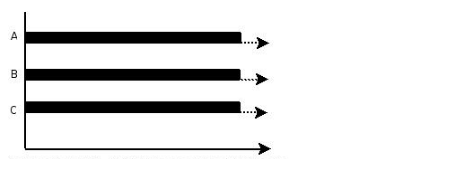

## Java并发基本知识

### 什么是线程、进程？有什么区别？
- **线程**：线程是操作系统进行任务调度的最小单位，一条线程指的是一个单一顺序的控制流
- **进程**：在面向进程设计的系统（如早期的UNIX，Linux 2.4及更早的版本）中，进程是程序的基本执行实体；在面向线程设计的系统（如当代多数操作系统、Linux 2.6及更新的版本）中，进程本身不是基本运行单位，而是线程的容器。
> ——整理自维基百科[进程](https://zh.wikipedia.org/wiki/%E8%A1%8C%E7%A8%8B)、[线程](https://zh.wikipedia.org/wiki/%E7%BA%BF%E7%A8%8B)

通俗来说，进程是OS中一个程序运行的实例，是对正在运行的程序的一种抽象描述，它管理了至少一个线程，线程才是任务执行的主体。
### 并发与并行是什么？
- **并发**：同一时间段，多个任务都在执行 (单位时间内不一定是同时执行的)  

- **并行**：单位时间内，多个任务同时执行  

从宏观来看，这两个看起来都是在一段时间内同时进行了多任务处理，但是微观上讲，**并发**侧重于**多个任务同时开始**了，但是开始之后怎么执行的并不关心（一般来说是争用CPU时间片执行，但甚至可能是串行）；**并行**更侧重于**多个任务同时在被执行**。  
*举个栗子：我（CPU）要吃饭和看电视（执行两个任务），从我吃饭或者看电视开始就可以叫做并发了，不管我先吃饭再看电视、还是一边吃饭一边看电视、或者吃一口饭看一眼电视，都是并发；但是并行是指我嘴里吃饭的时候，眼睛也在看着电视。*
### 为什么要使用多线程？
- 从资源利用来看：线程是操作系统任务调度的最小单位，一个线程在IO操作时，可以让另一个线程执行计算操作，提高了系统资源利用率
- 从当前实际需要来看：现在的互联网系统动辄要求百万级、千万级的并发，用好多线程可以大大提高系统吞吐量

### 使用多线程会带来什么问题？
虽说多线程好，可以同时执行多个任务，但是用的不好反而成为系统累赘，比如我要执行十个任务，每个任务耗时1ms，串行执行需要10ms就可以完成；但是如果使用多线程，会产生额外的上下文切换的开销，并发执行花了20ms，那就得不偿失了。可能会有以下问题：
- **上下文切换**：CPU从保存上个线程的执行状态，到读取现在线程状态并开始执行的时间。在计算密集的场景下，频繁地上下文切换可能会有很大开销
- **死锁**，两个线程并行执行过程中，互相需要用到对方已经锁定的资源时发生
- **闲置资源**：如果系统的空闲资源并不充足，但是硬要启动很多线程，CPU当然会不堪重负，甚至导致宕机

### 什么是死锁？
在多任务系统下，当一个或多个进程等待系统资源，而资源又被进程本身或其他进程占用时，就形成了死锁。  

例如，一个进程 p1占用了显示器，同时又必须使用打印机，而打印机被进程p2占用，p2又必须使用显示器，这样就形成了死锁。 因为p1必须等待p2发布打印机才能够完成工作并发布屏幕，同时p2也必须等待p1发布显示器才能完成工作并发布打印机，形成循环等待的死锁。
### 怎么预防死锁？
先看下操作系统中死锁产生的条件：
1. **互斥条件**：该资源任意一个时刻只由一个线程占用
2. **请求与保持条件**：一个进程可以在等待时持有系统资源
3. **禁止抢占**：系统资源不能被强制从一个进程中退出，只有该进程使用完毕后释放资源
4. **循环等待条件**：一系列进程互相持有其他进程所需要的资源

解决死锁的话，破坏上面任意一个条件就可以，大家可以把每个条件破坏掉想一下是不是能解决，我就不一一列举了

### OS中进程和线程有哪几种状态？Java中线程有哪几种状态？

### `sleep()`和`wait()`方法有什么区别？

### `start()`方法也是调用`run()`方法去执行，为什么我们不直接调用`run()`方法？