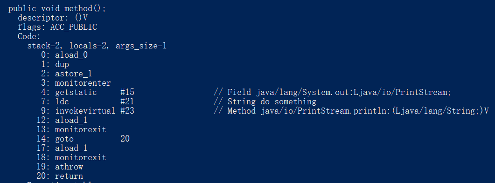
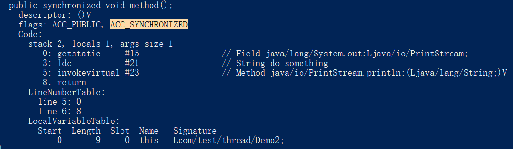
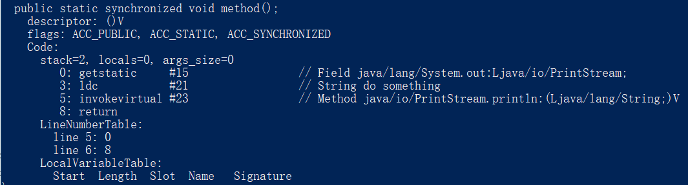

## 锁

### `synchronized`关键字？
`synchronized`关键字是Java解决多个线程并发访问临界资源问题的一种解决方案，它保证了在同一时刻只能有一个线程访问临界资源。

在JDK1.6之前，`synchronized`关键字属于重量级锁，线程是映射到操作系统的原生线程之上的，如果要挂起或者唤醒一个线程，都需要操作系统把线程从用户态转换到内核态，这个操作时很耗时的，所以之前的`synchronized`关键字效率很低。

在JDK1.6之后，Java官方从JVM层面对synchronized进行了较大优化，引入了偏向锁、轻量级锁，最后才升级到重量级锁，在很多场景下其实偏向锁、轻量级锁都可以解决问题，所以效率倍增！

### `synchronized`关键字有哪些用法？在实际项目中是怎么用的呢？
1. **修饰成员方法**：加在成员方法上，作用的是当前**对象**，调用实例方法时需要先获取对象的锁。

2. **修饰静态方法**：修饰静态方法时，作用的是整个**类的所有对象**，也就是说调用这个类对象的任意方法时，都会先获取类的锁。

3. **修饰代码块**：修饰代码块时，锁的可以是**任意对象或类**，进入同步代码块前会获取指定对象的锁。

在目前分布式泛滥的背景下，大部分的场景用的都是分布式锁，我感觉单机锁其实用处不大，但是在懒汉式的单例模式中，就采用了**双重校验锁**的机制：
```java
public class Singleton {

	// 使用volatile修饰
	private volatile static Singleton singleton;

	// 构造函数私有化，保证外部无法通过构造函数实例化
	private Singleton() {}
	
	public static Singleton getInstance() {
		if (singleton == null) {
			// 先加锁
			synchronized (Singleton.class) {
				// 进来需要再次校验，防止重复创建实例
				if (singleton == null) {
					singleton = new Singleton();
				}
			}
		}
		return singleton;
	}
}
```
### volatile关键字用处？
#### 可见性问题
在JDK1.2之前，Java中变量是直接从主存（也就是JVM的那块内存）中读取的，这是没问题的，但是效率不够快，因此当前的Java内存模型中，变量是可以在[CPU缓存](https://zh.wikipedia.org/wiki/CPU%E7%BC%93%E5%AD%98)中有一份拷贝的，如图：


很明显，当一个线程把数据写入工作内存但还没有写入主存，另外一个线程读取该数据时就会出现**数据不一致**的问题，因此有了`volatile`关键字，使用`volatile`修饰的变量将直接读取主存，如图：


#### 指令重排序问题
拿懒汉式的单例模式中`singleton = new Singleton();`这句话来看，这句话其实大致分为三步进行：
1. 给singleton分配一块内存空间
2. 初始化singleton
3. 将singleton指向分配的内存空间

由于JVM具有指令重排的特性，原本1-2-3的顺序可能变成了1-3-2，这样在单线程下是没问题的，可以获得一样的效果，但是在多线程下，可能会让另一个线程拿到一个还没初始化的实例！这时如果使用`volatile`修饰变量，JVM将不会对此变量进行指令重排序。

**总的来说，`volatile`关键字有以下用处：**
- 保证变量的可见性
- 防止指令重排序

### `synchronized`的底层原理
`synchronized`是Java中的一个关键字，因此它的运作是由JVM来控制的，我们可以使用`javap`命令来查看字节码信息，具体分情况来看：

1. `synchronized`同步代码块时，Java文件如下：
```java
public class Demo {
	public void method() {
		synchronized(this) {
			System.out.println("do something");
		}
	}
}
```
找到class文件，执行`javap -c -s -v -l .\Demo.class`，可以看到字节码文件，其中关键部分如下：


> 完整字节码请看[这里](./source/Demo.class)

可以看到，标号为4、7、9的内容是我们`synchronized`代码块中的内容，在标号为3、13的地方分别有`monitorenter`和`monitorexit`，因此可以看出：

**synchronized 同步语句块的实现使用的是 `monitorenter` 和 `monitorexit` 指令，其中 `monitorenter` 指令指向同步代码块的开始位置，`monitorexit` 指令则指明同步代码块的结束位置。** 当执行 `monitorenter` 指令时，线程试图获取锁也就是获取 `monitor`(monitor对象存在于每个Java对象的对象头中，synchronized 锁便是通过这种方式获取锁的，也是为什么Java中任意对象可以作为锁的原因) 的持有权。当计数器为0则可以成功获取，获取后将锁计数器设为1也就是加1。相应的在执行 `monitorexit` 指令后，将锁计数器设为0，表明锁被释放。**如果获取对象锁失败，那当前线程就要阻塞等待，直到锁被另外一个线程释放为止。**

2. `synchronized`修饰成员方法时，Java文件如下：
```java
public class Demo2 {
	public synchronized void method() {
		System.out.println("do something");
	}
}
```
同上查看字节码文件，关键如下：

> 完整字节码请看[这里](./source/Demo2.class)

通过对比上个字节码文件，可以看到这时没有了`monitor`的指令，取而代之的是flags的内容多了个`ACC_SYNCHRONIZED`，也就是说，**`ACC_SYNCHRONIZED`标记标识了这个方法是一个同步方法，JVM统统此标记来判断是否要进行同步方法调用。**

3. `synchronized`修饰静态方法时，Java文件如下：
```java
public class Demo3 {
	public synchronized static void method() {
		System.out.println("do something");
	}
}
```
查看字节码文件，关键如下：

> 完整字节码请看[这里](./source/Demo3.class)

我们发现，相比同步成员方法时，这里的flags只是多了一个`ACC_STATIC`标识而已（*PS.由此也可以看出方法的修饰符都是在flags里面声明的*），因此`synchronized`在修饰静态方法和成员方法时其实原理是一样的，因此**不管是类直接调用静态方法还是通过实例调用静态方法，JVM都会读取到`ACC_SYNCHRONIZED`标记，从而进行同步调用！**

### 在JDK1.6以后，`synchronized`做了哪些优化？
我们知道，JVM并不能对线程直接执行挂起、唤醒等操作，而JDK1.6之前，需要做同步操作时，需要操作系统将线程从用户态转换到内核态，这个操作代价很大，因此对于这种方式实现的锁我们称之为**重量级锁**、

在JDK1.6开始，对`synchronized`做了优化，将锁划分为四种状态，依次是：**无锁、偏向锁、轻量级锁、重量级锁**。他们随着竞争的激烈逐步升级，并不可降级。

为了实现这几种状态，Java做了如下的优化：

1. 锁粗化  
   这个优化并不是JVM来操作的，而是一种编程时的建议：理论上我们编写代码时，期望将同步块的范围尽量缩小，这样可以减少不必要的同步等待；但是，如果一系列的操作都对一个对象反复加锁解锁，也可能带来不必要的性能消耗！这时需要根据实际场景来选择啦~

2. 锁消除  
   对于锁的优化其实在运行时就已经开始了：JVM如果**检测到哪些临界资源不可能存在竞争，那么就执行锁消除**，直接把锁干掉，这样执行同步操作时就不必再加锁了。
     
3. 偏向锁  
顾名思义，偏向锁就是偏心，它会偏向于第一个获取偏向锁的线程，如果线程接下来的执行中没有其他线程来竞争锁，那它就**不需要进行同步操作**，就仿佛跟没加锁一样。

4. 轻量级锁  
当偏向锁失效时，JVM会使用轻量级锁。**轻量级锁的加锁和解锁都使用CAS操作**，CAS操作实质并不是锁，只是通过Compare And Swap来保证能达到预期效果，它的依据是“**对于绝大部分锁，在整个同步周期内都是不存在竞争的**”，这是一个经验数据。  
但是，如果锁竞争激烈，一直执行CAS操作时，轻量级锁反而会有更大的开销！这时将很快膨胀为重量级锁！

5. 自旋锁和自适应自旋锁  
   当锁膨胀为重量级锁时，JVM为了避免线程真实地在操作系统层面挂起，还会使用一种“自旋锁”的手段进行优化。  
   自旋锁的依据是“**一般线程持有锁的时间都不是太长，所以仅仅为了这一点等待的时间去挂起线程/恢复线程是得不偿失的**”，因此，**在线程获取锁失败时，并不对他执行挂起操作，而是让该线程执行一个忙循环，保持活跃状态并一直尝试获取锁**，因此称为“自旋”。  
   自旋锁其实在JDK1.6之前就已经引入了，但是默认是关闭状态，需要通过`--XX:+UseSpinning`配置将其开启；JDK1.6开始就改为默认开启了。  
   **需要注意的是：**
   - 自旋锁并不能完全替代线程挂起，因为它需要让线程保持运行状态，这样会**占用CPU时间**！
   - 由上可以想到，占用CPU时间短的话，自旋锁的效果当然好，但是一直占用的话反而得不偿失！因此**自旋超过一定次数时，就必须挂起线程了**。自旋次数的默认值是10次，用户可以修改`--XX:PreBlockSpin`来更改

   另外在JDK1.6中引入了**自适应自旋锁**，它与自旋锁不同的是：自旋时间不固定了，而是通过上一次获取这个锁的自旋时间和锁的拥有者状态来决定，虚拟机变得更加机智了。


### `synchronized`和`ReentrantLock`的异同
1. **两者都是可重入锁**  
   可重入锁是指：线程可以再次获取自己线程持有的锁。比如一个线程先对某个对象加锁了并且还没有释放，当它再次想获取该对象的锁时是可以的（*理论应该是在一个线程上也不会产生线程安全问题*）。对于不可重入锁，这种操作会产生死锁（*我等我自己释放锁？神仙操作吧~*）。
2. **`synchronized`依靠JVM实现，`ReentrantLock`依赖类库实现**  
   `synchronized`是一个关键字，JVM会依据此关键字进行加锁解锁处理；但`ReentrantLock`是实现`Lock`接口的一个类，加锁和解锁操作需要显式调用`lock()`和`unlock()`方法。
3. **`ReentrantLock`比`synchronized`功能更加丰富**  
   `synchronized`完全由JVM控制因此只能进行加锁解锁操作，而`ReentrantLock`通过编程的方式让同步操作可以有更多功能，综合如下：  
   - **等待可中断**：正在等待的线程可以选择放弃等待，改为处理其他事情，通过`lock.lockInterruptibly()`来实现
   - **可指定公平锁**：公平锁遵循FIFO原则，可以让先请求锁的线程先拿到锁。`ReentrantLock`默认为非公平锁，可以通过`ReentrantLock(boolean fair)`构造方法指定为公平锁，而`synchronized`只能为非公平锁
   - **线程调度更加灵活**：`synchronized`通过`wait()`和`notify/notifyAll()`方法可以实现线程等待和唤醒，但是如果执行`notifyAll()`方法的话就会通知所有处于等待状态的线程，这样会造成很大的效率问题；但是在`ReentrantLock`中借助了`Condition`实例可以实现**选择性通知**，当调用`Condition`实例的`signalAll()`方法时，只会唤起注册到此`Condition`实例的等待线程。

### `synchronized`和`volatile`的区别
- 作用对象：`synchronized`能用在方法、代码块，而`volatile`只能修饰变量
- 阻塞：`synchronized`会发生阻塞，`volatile`不会阻塞线程
- 功能方面：`synchronized`能保证数据的原子性和可见性，`volatile`只能保证可见性

总的来说，`synchronized`主要是解决**临界资源并发访问**的问题，而`volatile`主要为了解决**临界资源的可见性**问题。
### 乐观锁与悲观锁
这里的乐观锁与悲观锁已经不局限于Java语言了，道理都是通用的。
#### 乐观锁
乐观锁总是假设最好的情况，**其实在同步过程中没有加锁**，而是在修改数据的时候判断下在操作期间数据有没有被别的线程更改，适用于**读多写少的场景**，乐观锁的实现主要有两种：
1. **版本号机制**  
    一般是在需要修改的内容加上一个版本号的标记，标识数据被操作的次数，当操作数据时，同时会检查当前版本与拿到的版本是否一致，如果一致则操作成功，并将版本号+1；如果不一致则操作失败，重试。  
    **举个栗子**：数据库有一个账户表，字段和信息如下：
    |USER_ID | MONEY | VERSION|
    |--------|-------|--------|
    |123456  |100    |1       |
    我们模拟两个线程A和B同时操作这一个账户的情况：
    1. A线程读取到用户123456的余额为100，版本号为1，然后将余额扣除50；
    2. B线程读取到用户123456的余额为100，版本号为1，然后将余额扣除20；
    3. A线程完成了操作，将版本号+1变为2，提交数据，比对表中目前版本号为1，成功将余额更新为50，版本号更新为2
    4. B线程完成了操作，将版本号+1变为2，提交数据，比对表中目前版本号为2，发现并不是读取到的1，于是操作没能成功

2. **CAS算法**  
    CAS（compare and swap），比较和交换，是一种有名的**无锁算法**。无锁编程，即不使用锁的情况下实现多线程之间的变量同步，也就是在没有线程被阻塞的情况下实现变量的同步，所以也叫非阻塞同步（Non-blocking Synchronization）。  
    与版本号机制不同的是，CAS操作不需要额外的版本信息，直接**通过比较要更新的值是否与最初读取到的值相等**来判断是否提交更改。我们还拿上面的例子来说明：  
    现在表内容变成了：

    USER_ID | MONEY 
    --------|-------
    123456  |100    
    模拟两个线程A和B同时操作这一个账户的情况：
    1. A线程读取到用户123456的余额为100，然后将余额扣除50；
    2. B线程读取到用户123456的余额为100，然后将余额扣除20；
    3. A线程完成了操作，提交数据，比较数据库中余额为100，成功更新余额为50
    4. B线程完成了操作，提交数据，比较数据库中余额为50，与最初读取到的100不符，操作没能成功

虽然CAS操作看起来方便实用，但是会存在一些问题：
- **ABA问题**：ABA问题是指如果一个线程经过一系列操作后，将值又修改回了原值，那另一个线程在比较的时候是可以通过的，但实际这个值已经不是最初那个值了
- **自旋操作时间消耗问题**：CAS操作失败后会进行自旋操作来保证最终操作成功，但是如果竞争很激烈，大量的线程一直处于自旋状态，占用CPU时间，不如直接用悲观锁！
- **只能保证一个共享资源的原子操作**：如果操作涉及多个共享变量时CAS操作无法支持。但是从 JDK 1.5开始，提供了`AtomicReference`类来保证引用对象之间的原子性，你可以把多个变量放在一个对象里来进行CAS操作.所以我们可以使用锁或者利用`AtomicReference`类把多个共享变量合并成一个共享变量来操作。

#### 悲观锁
悲观锁总是假设最坏的情况，因此每次操作的时候都会对临界资源上锁，保证不会产生线程安全问题，但是会让别的线程阻塞等待。Java中的`synchronized`和`ReentrantLock`，在数据库中的表锁、行锁、读写锁都是悲观锁的实现。

#### 适用场景比较
乐观锁与悲观锁各有优缺点，并无好坏之分，适用于真实场景才是最好的。乐观锁适用于**读多写少的场景**，因为这种情况下冲突发生几率不大，一旦发生冲突了，再重试一次很大可能就成功了；**但是在写多读少的场景中使用乐观锁的话，冲突概率可能就很高，如果一直重试反而会拖累系统性能，还不如直接用悲观锁效果会更好**！

### 公平锁和非公平锁

### 可重入锁和不可重入锁


