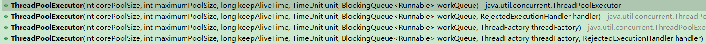
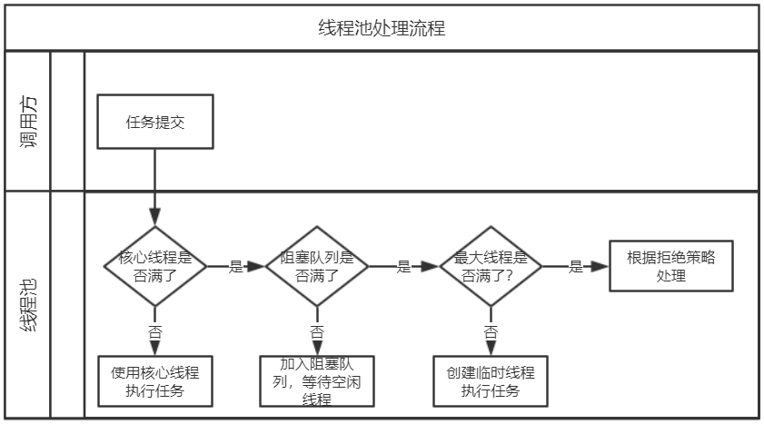

## Java线程深入

### Java中如何创建线程有几种方式？
#### 创建无需返回值的线程
1. 直接继承Thread类，重写`run()`方法：
```java
public class AThread extends Thread {
	@Override
	public void run() {
		// TODO something
		System.out.println("直接继承Thread实现线程");
	}
}
```
2. 因为Java只允许单继承，所以也可以实现`Runnable`接口实现`run()`方法，然后调用`Thread`类的`Thread(Runnable target)`方法去创建一个线程：
```java
public class BThread implements Runnable {
	@Override
	public void run() {
		// TODO something
		System.out.println("实现Runnable接口的线程");
	}
}
```
这两种方式创建线程的启动如下：
```java
public static void main(String[] args) {
    AThread a = new AThread();
    a.start();// 直接继承Thread实现线程
    Thread b = new Thread(new BThread());
    b.start();// 实现Runnable接口的线程
}
```
#### 创建需要返回值的线程
与实现`Runnable`接口的`run()`方法类比，带返回值的线程需要实现`Callable`接口的`call()`方法，通过一个泛型来指定返回的类型：
```java
public class CThread implements Callable<String> {
	@Override
	public String call() throws Exception {
		// TODO something
		return "这是带返回值的线程";
	}
}
```
启动线程和获取返回值需要借助`FutureTask`工具类，线程启动后可以通过`isDone()`方法获取线程状态，方式如下：
```java
public static void main(String[] args) {
    FutureTask<String> futureTask = new FutureTask<>(new CThread());
    Thread c = new Thread(futureTask);
    c.start();
    while (true) {
        if (futureTask.isDone()) {// 线程执行完毕
            try {
                System.out.println(futureTask.get());// 这是带返回值的线程
                break;
            } catch (InterruptedException e) {
                e.printStackTrace();
            } catch (ExecutionException e) {
                e.printStackTrace();
            }
        }
    }
}
```
### 有了线程，为什么要使用线程池？
> 使用线程池的好处是减少在创建和销毁线程上所消耗的时间及系统资源，解决资源不足的问题。  
> 如果不使用线程池，有可能系统创建大量同类线程而导致消耗完内存或者“过度切换”的问题。  
> ——引用自《阿里巴巴Java开发手册》P28

通俗一点，就是线程每次创建是必然要消耗系统资源的，但是线程池不会每次都创建新线程，所以需要使用线程时，尽量采用线程池吧~
### 如何创建线程池？
#### 使用`Executors`工具类创建（不推荐）
- 不设置上限的两个：
  - `Executors.newCachedThreadPool()`：创建核心线程为0，最大线程数为int型最大值数量，超时时间为60s，阻塞队列为`SynchronousQueue`的线程池
  - `Executors.newScheduledThreadPool(int corePoolSize)`：创建核心线程为corePoolSize，最大线程数为int型最大值的线程池，超时时间为0，阻塞队列为`DelayedWorkQueue`
- 设置上限的两个：
  - `Executors.newFixedThreadPool(int nThreads)`：核心线程和最大线程都为nThreads，超时时间为0，阻塞队列为`LinkedBlockingQueue`
  - `Executors.newSingleThreadExecutor()`：核心线程和最大线程都为1，超时时间为0，阻塞队列为`LinkedBlockingQueue`

> 为什么不推荐？  
> Executors 返回线程池对象的弊端如下：  
> - `FixedThreadPool`和`SingleThreadExecutor`：允许请求的队列长度为`Integer.MAX_VALUE`，可能堆积大量的请求，从而导致OOM。
> - `CachedThreadPool`和`ScheduledThreadPool`：允许创建的线程数量为`Integer.MAX_VALUE`，可能会创建大量线程，从而导致OOM。  
> ——引用自《阿里巴巴Java开发手册》P29

#### 直接使用`ThreadPoolExecutor`构造方法创建（推荐）
四个构造方法：



### ThreadPoolExecutor类构造方法参数有哪些？
`ThreadPoolExecutor`共有四个构造方法，最终都调入了一个构造方法：
```java
public ThreadPoolExecutor(int corePoolSize,
                              int maximumPoolSize,
                              long keepAliveTime,
                              TimeUnit unit,
                              BlockingQueue<Runnable> workQueue,
                              ThreadFactory threadFactory,
                              RejectedExecutionHandler handler)
```
解释：
- **corePoolSize**：核心线程数。线程池会一直维护已创建的线程的最大数量。
- **maximumPoolSize**：最大线程数。用与当前线程达到`corePoolSize`并且阻塞队列也满了以后，会创建临时线程执行任务，直到`maximumPoolSize`大小。
- **keepAliveTime**：存活时间。用于控制线程的闲置时间，空闲超时后线程会退出，直到达到`corePoolSize`大小。
- **unit**：`keepAliveTime`的单位。从纳秒到天共7种。
- **workQueue**：阻塞队列。用于当前任务数超过`corePoolSize`时，新来的任务会进入`workQueue`排队，等待核心线程空闲后执行。
- **threadFactory**：线程工厂。可以自行重写方法，以实现创建线程属性的个性化，一般来说默认实现就够用了。
- **handler**：拒绝策略。用于当前线程达到`maximumPoolSize`时，线程池该怎么处理新来的任务，默认是抛出异常。

### 阻塞队列有哪些？
*注意：这里的阻塞队列并不是只在线程池中使用的*
- **LinkedBlockingQueue**：基于**链表**实现的阻塞队列，可以不指定大小，默认为`Integer.MAX_VALUE`
- **ArrayBlockingQueue**：基于**数组**实现的一个阻塞队列，初始化时**必须指定容量**大小。并且可以指定公平性与非公平性，默认为**非公平**的，即并不是FIFO，大家一起抢CPU时间片
- **PriorityBlockingQueue**：优先级阻塞队列，按照元素优先级排序
- **DelayQueue**：基于`PriorityBlockingQueue`实现的延迟队列，只有当延时时间到了，元素才能被取出
- **SynchronousQueue**：顾名思义，同步队列，只能容纳一个元素，写入时如果存在元素，线程将会阻塞知道队列元素被取出；如果读取时没有元素，线程也会阻塞知道队列被放入元素。使用SynchronousQueue的目的就是保证“对于提交的任务，如果有空闲线程，则使用空闲线程来处理；否则新建一个线程来处理任务”。

### 拒绝机制有哪些？
- ThreadPoolExecutor.**AbortPolicy**：默认值，丢弃任务并抛出`RejectedExecutionException`异常
- ThreadPoolExecutor.**DiscardPolicy**：也是丢弃任务，但是不抛出异常
- ThreadPoolExecutor.**DiscardOldestPolicy**：丢弃队列最前面的任务，然后重新尝试执行任务（重复此过程）
- ThreadPoolExecutor.**CallerRunsPolicy**：由调用线程处理该任务 

### `execute()`方法和`submit()`方法的区别是什么呢？
最重要的区别就是**是否需要返回值**：
- `execute()`：用于提交不需要返回值的任务，所以无法判断任务是否被线程池执行成功与否
- `submit()`：用于提交需要返回值的任务。线程池会返回一个`Future`类型的对象，通过这个`Future`对象可以判断任务是否执行成功，也可以通过`get()`方法来获取返回值，但是会阻塞当前线程等待，可以通过`get(long timeout，TimeUnit unit)`方法设置等待时间，到期后不管线程是否执行完，当前线程会继续执行

### 线程池的执行过程是什么？
一张流程图：



可以看到，构造方法的核心线程数、最大线程数、阻塞队列、拒绝策略都被用到了，还有一些细节需要注意：
- 核心线程并不是线程池初始化时被创建的，而是需要时才会被创建
- 如果使用了线程池，一定记得在应用关闭时，同时关闭线程池（`shutdown()`和`shutdownNow()`方法），否则由于线程没有退出，进程也会常驻，资源释放不掉！

### 如何关闭线程池？
两个方法都可以关闭线程池，核心在于是否中断正在执行的任务：
- `shutdown()`：先拒绝接收新任务，然后**中断未执行的任务**，最后等待正在执行的任务执行完毕后，关闭线程池
- `shutdownNow()`：先拒绝接收新任务，然后**中断所有的正在执行和未执行任务**，并返回被中断的任务列表

### 线程池的核心线程数量如何设置？
这个问题需要结合业务来考虑，大致分为以下两种情况：
- **计算密集型**：对于这种对CPU需求量大的业务，如果线程数过多反而会拖慢整个任务进度，一般设置为CPU核心数相等的线程数
- **IO密集型**：这种任务对CPU负载不高，因此可以适当增加线程数，提高CPU利用率，一般设置为CPU核心数X2大小

但是！以上都是理论值，在一台服务器只使用一个线程池时是合理的，但是如果一台机器运行了多个应用，其他应用也用到了线程池呢？那这个规则就不是很适用了，因此还需综合考虑其他因素。

在网上的一篇文章[《如何合理地估算线程池大小？》](http://ifeve.com/how-to-calculate-threadpool-size/)中有提出一个计算公式：

> 最佳线程数目 = （（线程等待时间+线程CPU时间）/线程CPU时间 ）* CPU数目

这个公式会把线程等待时间与线程执行时间之和认为是一个线程执行的真实时间，再与执行时间求一个比重，最后乘以CPU核心数预估出最佳线程数，我认为是大致合理的，它得出一个结论是：

**线程等待时间所占比例越高，需要越多线程；线程CPU时间所占比例越高，需要越少线程。**